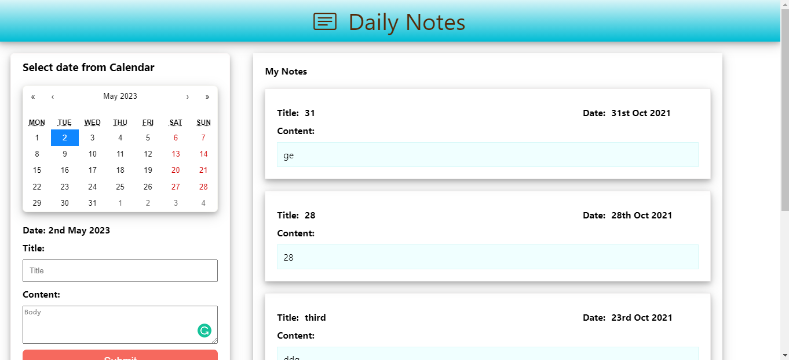

<!-- ABOUT THE PROJECT -->
## About The Project


Daily Notes

### Built With

This section should list any major frameworks that you built your project using. Leave any add-ons/plugins for the acknowledgements section. Here are a few examples.
* [React](https://reactjs.org/)
* [Javascript](https://www.javascript.com/)


<!-- GETTING STARTED -->
## Getting Started

This project is about taking notes
 

### Installation

1. Clone the repo
   ```sh
   git clone https://github.com/ssunilkkumar/dailynotes.git
   ```
2. Install NPM packages
   ```sh
   npm install npm
   ```


<!-- USAGE EXAMPLES -->
## screenshot



<hr/>


## DEMO
* signup then sign in(require email verification)

* link [https://master.d38brrqxtnf511.amplifyapp.com/](https://master.d38brrqxtnf511.amplifyapp.com/)
* click on Add to bag
* click on Bag icon to check product in cart
* Can remove from cart
* Can Select size and quantity of product


<!-- CONTACT -->
## Contact

Your Name - [Sunil](https://www.linkedin.com/in/ssunilkkumar/)

Project Link: [https://github.com/ssunilkkumar/dailynotes](https://github.com/ssunilkkumar/dailynotes)
